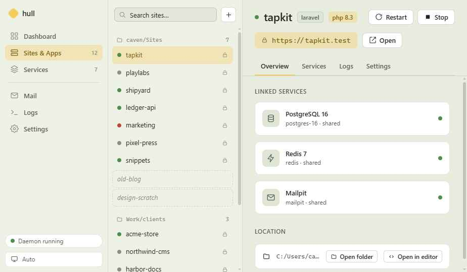
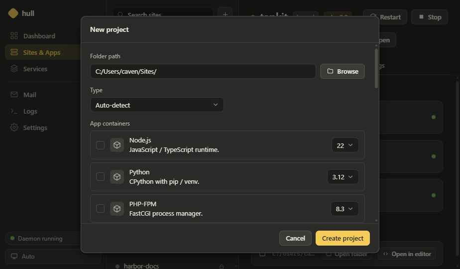
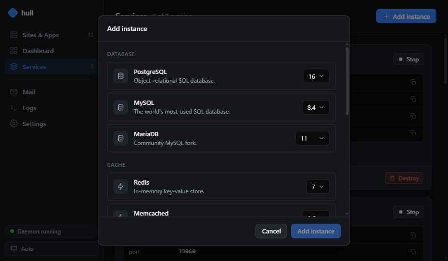
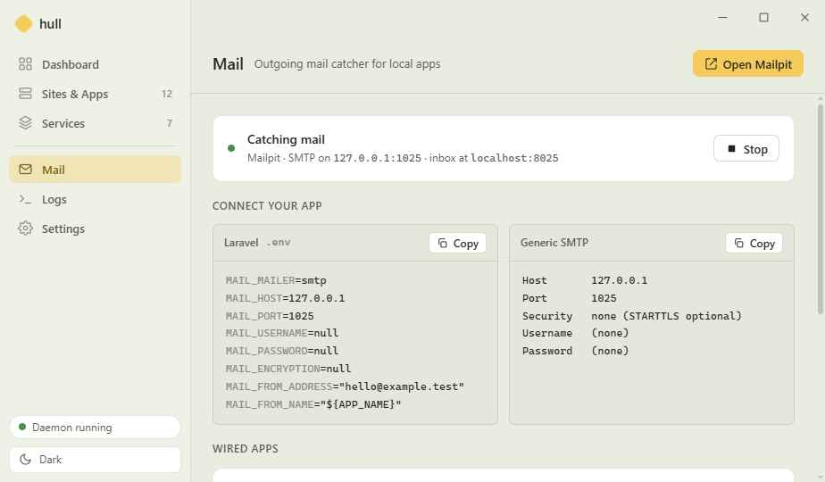
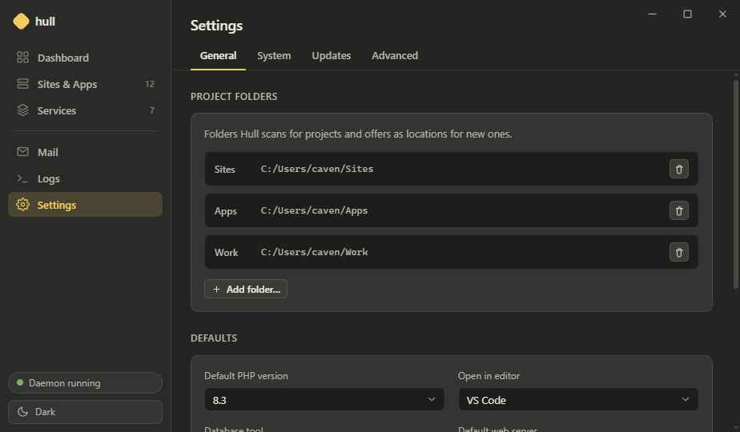

<div align="center">


# Hull 🚢

**A fast, cross-platform local development environment.**
Docker-based dev sites with automatic HTTPS domains, shared databases, and a one-command setup — driven by a CLI, a daemon, and an optional desktop app.

Runs on **Windows · macOS · Linux** (Arch & Debian/Ubuntu).



</div>

---

## What is Hull?

Hull provisions Docker-based local development environments and serves each project at a trusted `https://<name>.test` address — no port juggling, no manual nginx/Caddy config, no `/etc/hosts` editing.

It scaffolds Laravel, WordPress, and plain-PHP projects in one command, runs shared database instances multiple projects can share, and routes everything through an embedded HTTPS reverse proxy with a locally-trusted certificate authority.

Hull v2 is a ground-up **Go rewrite** of the original bash tool (which lives on the [`legacy`](../../tree/legacy) branch). It is cross-platform, daemon-backed, and ships with an optional desktop GUI.

> **Source of truth:** every project is described by a small `hull.yaml`. The `compose.yaml` Hull runs is a generated artifact — never hand-edited.

---

## Table of contents

- [Features](#features)
- [How it works](#how-it-works)
- [Requirements](#requirements)
- [Installation](#installation)
- [First-run setup](#first-run-setup)
- [Quick start](#quick-start)
- [CLI reference](#cli-reference)
- [The desktop app](#the-desktop-app)
- [Configuration](#configuration)
- [Platform notes](#platform-notes)
- [Uninstalling](#uninstalling)
- [Philosophy & contributing](#philosophy--contributing)
- [License](#license)

---

## Features

- **One-command scaffolding** — `hull new shop laravel --db postgres` creates the project, wires the framework, and boots it at `https://shop.test`.
- **Automatic HTTPS & DNS** — an embedded Caddy reverse proxy with a local root CA serves every site over trusted TLS; a built-in wildcard resolver answers `*.test` (no `dnsmasq` container required).
- **Shared service instances** — run `postgres-16`, `mariadb-lts`, `redis`, etc. once and link many projects to them; multiple versions live side by side.
- **Headless or GUI** — the CLI is fully featured on its own. A running daemon adds live routing, a desktop app, and background jobs — but is never required.
- **Portable bundles** — `hull export` produces a `hull-bundle.zip` (project + fresh DB dumps) that `hull import` restores on another machine.
- **Adopt what you already have** — import existing projects, wrap multi-container `docker compose` stacks as **clusters**, or migrate projects from bash-Hull (v1).
- **Ephemeral & native tooling** — `hull npm run dev` runs in a throwaway Node container; `hull artisan ...` and `hull exec ...` run straight against your project's app container — no host pollution.

---

## How it works

```
          ┌──────────────┐        ┌──────────────┐
 hull ───▶│              │        │  Docker      │
 (CLI)    │    hulld     │───────▶│  Engine      │
          │  (daemon)    │        └──────────────┘
 GUI ────▶│              │
          │  • engine    │   embedded, in-process:
          │  • router    │   • Caddy HTTPS proxy + local CA
          │  • DNS       │   • wildcard *.test resolver
          │  • services  │   • OS trust-store integration
          └──────────────┘
                 ▲
        hull.yaml │ generates  compose.yaml ──▶ docker compose
```

- **`hulld`** is one Go daemon that owns everything: the project engine, shared services, the embedded Caddy router (with a local SSL CA), the wildcard DNS resolver, and OS trust-store management — all behind a localhost API guarded by a bearer token.
- **`hull`** is a thin client over that API. When no daemon is running it executes the **same engine code in-process**, so the CLI works fully headless.
- The **desktop app** is a Tauri shell that talks to the same API and can manage the daemon's lifecycle.
- Each project's **`hull.yaml`** is rendered into a `compose.yaml` (covered by golden tests) and run with `docker compose`. The router discovers each container's published loopback port and proxies `https://<name>.test` to it.

---

## Requirements

| Purpose | Needs |
|---|---|
| **Running Hull** | Docker Engine + the `docker compose` plugin (Docker Desktop, `docker.io`, Podman, OrbStack, or Colima) |
| **Building from source** | Go **1.26+** |
| **Building the GUI** | Rust (`rustup`), and on Linux: `webkit2gtk-4.1` + `libayatana-appindicator` |

---

## Installation

There are no prebuilt release binaries yet, so Hull installs by building from source. Clone the repo and run the installer:

```bash
git clone https://github.com/CavenRE/hull.git
cd hull
./install.sh           # builds & installs the CLI (hull + hulld) to ~/.local/bin
```

The installer checks your dependencies, offers to install any that are missing (via your package manager), builds the binaries with version info, and adds `~/.local/bin` to your `PATH`.

**Install the desktop app too:**

```bash
./install.sh --gui     # also builds and installs the Tauri app (hull-gui)
```

Other flags: `--prefix DIR` (install location), `--no-gui`, `--skip-setup`, `--yes` (non-interactive).

> On Windows, build with `go build ./cmd/hull` / `./cmd/hulld` and the Tauri app via `cargo`/`tauri`; a PowerShell installer is planned.

---

## First-run setup

Once installed, enable native networking on the machine (one time):

```bash
hull setup     # enable the embedded router (:80/:443) + DNS, install the local CA
hull trust     # trust Hull's root certificate (may prompt for sudo)
hull doctor    # verify Docker, ports, resolution, certificate, daemon
```

Then start the daemon and you're live:

```bash
hulld          # or: hull daemon run
```

See [Platform notes](#platform-notes) for Linux specifics (privileged ports, DNS resolvers).

---

## Quick start

```bash
# Scaffold a Laravel app with a dedicated Postgres database, and boot it
hull new shop laravel --db postgres

# → https://shop.test  (trusted HTTPS, ready to go)

hull list                 # see every project and its state
hull logs shop            # tail its container logs
hull artisan shop migrate # run artisan against the app container
hull down shop            # stop it (data is preserved)
```

---

## CLI reference

Run `hull <command> --help` for full flags on any command.

### Projects & lifecycle

| Command | What it does |
|---|---|
| `hull new <name> <template>` | Scaffold a project (`laravel`, `wordpress`, `plain`). Flags: `--db`, `--db-version`, `--redis`, `--php`, `--version`, `--service eng[@ver]` (repeatable), `--serve`, `-i/--interactive`, `--no-db`, `--no-start`. |
| `hull up [name...]` | Start the current project, named ones, `--all`, or pick interactively. |
| `hull down [name...]` | Stop environments (data preserved). |
| `hull restart [name]` | Restart a project's containers. |
| `hull rebuild [name]` | Rebuild images and bring the project back up (`--no-cache`). |
| `hull reset [name]` | Wipe the project's data volumes and start fresh. |
| `hull rm <name>` | Destroy an environment and its data. |
| `hull logs [name]` | Tail a project's container logs. |
| `hull status` | Show running containers and their ports. |
| `hull list` | List registered projects and their state. |
| `hull render` | Regenerate `compose.yaml` from a project's `hull.yaml`. |

### Project settings

| Command | What it does |
|---|---|
| `hull set <project>` | Change `--php`, `--domain`, or `--serve` on a managed project. |
| `hull config get` | Print the current global configuration. |
| `hull config set` / `roots` / `defaults` | Set config values, manage project root folders, set default tools/versions. |
| `hull group add` / `ls` / `mv` / `order` | Organize projects into virtual groups (stored Hull-side; folders untouched). |

### Shared services

| Command | What it does |
|---|---|
| `hull services add <eng[@ver]>` | Create & start a shared instance (e.g. `postgres@16`). Aliases: `svc`, `service`. |
| `hull services list` / `start` / `stop` / `rm` | Manage shared instances (`rm` destroys all its databases). |
| `hull link <project> <eng[@ver]>` | Link a project to a shared instance (creates its database, wires the framework env). |
| `hull unlink <project> <key>` | Remove a linked service (e.g. `db`, `redis`) from a project. |

### Developer tooling

| Command | What it does |
|---|---|
| `hull artisan <args>` | Run Laravel artisan inside the current project. |
| `hull npm <args>` | Run npm in an ephemeral Node container (e.g. `hull npm run dev`). |
| `hull exec <cmd>` | Run any command inside the current project's app container. |

### Import · export · migrate · clusters

| Command | What it does |
|---|---|
| `hull import <name\|bundle>` | Import an existing project folder or a `hull-bundle.zip`. |
| `hull export <project>` | Export a project as a portable `hull-bundle.zip` (with fresh DB dumps). |
| `hull migrate <name>` | Adopt bash-Hull (v1) projects into v2. |
| `hull cluster add` / `ls` | Adopt an existing `docker compose` project as a cluster, and list adopted ones. |

### System & networking

| Command | What it does |
|---|---|
| `hull setup` | Enable the native router + DNS on this machine (`--skip-trust`, `--skip-dns`). |
| `hull trust` | Install/remove Hull's local root certificate in the OS trust store (`--uninstall`). |
| `hull doctor` | Diagnose the environment (Docker, ports, DNS, certs, daemon). |
| `hull daemon run` / `status` / `stop` | Manage the daemon (`run` is equivalent to `hulld`). |
| `hull completion <shell>` | Generate a shell autocompletion script. |

---

## The desktop app

The optional Tauri app is a thin client over the same daemon API — every action it takes is one you can also do from the CLI. Close it to the tray and the daemon keeps your sites running.

<table>
<tr>
<td width="50%"><br><sub>Scaffold a project with databases & services</sub></td>
<td width="50%"><br><sub>Run versioned shared database instances</sub></td>
</tr>
<tr>
<td width="50%"><br><sub>Built-in mail catcher</sub></td>
<td width="50%"><br><sub>Settings: loopback address, domain, daemon control</sub></td>
</tr>
</table>

Highlights: a project dashboard, shared-service management, a mail catcher, live logs, an onboarding/doctor panel, and **start / stop / restart** controls for the daemon itself.

---

## Configuration

**Global** — `~/.hull/config.yaml`:

```yaml
tld: test                     # local top-level domain
roots:                        # folders Hull scans for projects
  - ~/Work/Sites
router:
  enabled: true
  http_port: 80
  https_port: 443
  loopback: 127.0.0.1         # 127.0.0.1–.8: bind a different loopback to
                              # coexist with another local proxy
dns:
  enabled: true               # set false to use an external resolver for *.tld
  port: 53
defaults:
  php: "8.4"
  editor: code
  db_tool: tableplus
```

**Per project** — `hull.yaml` (the source of truth):

```yaml
schema: 1
name: shop
template: laravel
php: "8.4"
services:
  db:
    engine: postgres
    version: "16"
    mode: dedicated           # or "shared" to use a global instance
```

---

## Platform notes

**Linux — privileged ports.** The embedded router binds `:80`/`:443` directly (no container). Grant the capability once with the installer, or lower the unprivileged-port threshold system-wide:

```bash
sudo setcap 'cap_net_bind_service=+ep' ~/.local/bin/hulld
# or, surviving every rebuild:
echo 'net.ipv4.ip_unprivileged_port_start=80' | sudo tee /etc/sysctl.d/10-hull-ports.conf && sudo sysctl --system
```

**Linux — DNS resolver.** `hull setup` registers `*.<tld>` with `systemd-resolved` by default. If your machine resolves DNS through **NetworkManager + dnsmasq** instead, point `.<tld>` at `127.0.0.1` there and run `hull setup --skip-dns` (Hull then reuses your resolver instead of binding `:53`).

**Linux — file permissions.** On native Docker, Hull automatically remaps PHP containers to your host UID so bind-mounted project files (SQLite databases, `storage/`, caches) stay writable. Docker Desktop on macOS/Windows handles this in its VM.

**Coexisting with other stacks.** If you already run a local proxy on `127.0.0.2:443`, set `router.loopback` to a free `127.0.0.x` so Hull binds its own loopback IP without a port clash.

---

## Uninstalling

```bash
./uninstall.sh            # remove binaries; stop the daemon; undo trust/DNS
./uninstall.sh --purge    # also remove ~/.hull (config, CA, service data)
```

Your project files are never touched.

---

## Philosophy & contributing

**Built for me, free for you.** Hull exists to solve my own local-dev workflow, and it's designed to be simple to hack, modify, and extend.

Fork it and mould it to your stack. Pull requests are welcome, but be aware I may not merge (or review) changes that don't fit how I work — if you need Hull to do something specific, forking is your fastest path.

---

## License

MIT — see [LICENSE](LICENSE). Use it, modify it, ship it, take it apart. No strings attached.
